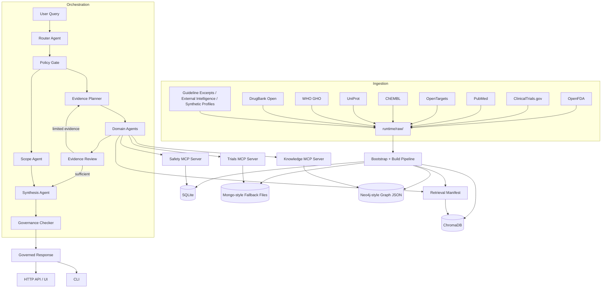

# T2D Therapeutic Intelligence Platform

This repository contains a runnable MVP for a Type 2 Diabetes therapeutic intelligence platform. The implementation is deliberately dependency-light so it can run offline with curated seed data, while keeping clear upgrade points for MongoDB, Neo4j, local LLM orchestration, and dense retrieval backends.

## What is implemented

- Offline-first ingestion scripts for OpenFDA, ClinicalTrials.gov, PubMed, OpenTargets, ChEMBL, UniProt, WHO GHO, and DrugBank Open, with live-backed refresh paths for all of those public sources
- Auxiliary ingestion scripts for guideline excerpts, external intelligence, and synthetic patient profiles
- Lightweight canonical entity resolution for drugs, targets, and trials
- SQLite-backed structured storage for labels, safety signals, and canonical tables
- File-backed fallbacks for MongoDB-style collections, Neo4j-style graph data, and retrieval manifests
- Three stdio MCP tool servers: safety, trials, and knowledge
- LangGraph-based multi-agent orchestration with centralized prompt templates, automatic local Ollama-assisted routing and synthesis when Ollama is reachable, deterministic fallback, governance, and JSON trace logging
- Evaluation scripts for retrieval, routing, groundedness, and latency
- Native context tools for WHO population context plus DrugBank and synthetic clinical context
- Ingestion lineage manifests written under `logs/ingestion_lineage/`
- A lightweight HTTP API for `/health`, `/backend-status`, and `/query`

## Architecture



## Question Scope

The platform now uses a broader routed scope instead of forcing every query into the original six enterprise lanes.

- `Q1`: safety surveillance
- `Q2`: trial and efficacy intelligence
- `Q3`: guideline and treatment sequencing
- `Q4`: mechanism and target landscape
- `Q5`: competitor and pipeline monitoring
- `Q6`: literature and population evidence
- `Q7`: general disease background and risk communication
- `Q8`: pricing, reimbursement, and market-access scope detection
- `Q9`: urgent or personal medical guardrail
- `Q0`: out-of-scope or clarification

`Q1` to `Q6` are the core enterprise intelligence lanes. `Q7` to `Q9` exist so general, personal, urgent, or unsupported questions do not get misrouted into the enterprise evidence stack.

## Quick start

1. Use Python 3.11 or newer, create a virtual environment, and install requirements.
2. Copy `.env.example` to `.env`.
3. Bootstrap the local data and storage artifacts:

```bash
python3 main.py bootstrap
```

Bootstrap writes refreshed runtime raw payloads under `runtime/raw/` so normal project use does not rewrite the tracked fixture files under `data/raw/`.

Runtime configuration is environment-driven through `.env` or shell variables. There is no separate YAML runtime config layer to keep in sync with the code.

To enable live-backed ingestion across the public source set:

```bash
set -a
source .env
set +a
USE_LIVE_OPENFDA_INGESTION=true \
USE_LIVE_CLINICALTRIALS_INGESTION=true \
USE_LIVE_PUBMED_INGESTION=true \
USE_LIVE_OPENTARGETS_INGESTION=true \
USE_LIVE_CHEMBL_INGESTION=true \
USE_LIVE_UNIPROT_INGESTION=true \
USE_LIVE_WHO_INGESTION=true \
USE_LIVE_DRUGBANK_OPEN_INGESTION=true \
python3 main.py bootstrap
```

4. Run a query:

```bash
python3 main.py query "For weekly incretin selection, summarize the direct phase 3 HbA1c and weight efficacy gap between tirzepatide and semaglutide in SURPASS-2."
```

The query path no longer auto-refreshes live sources just because live flags are set. If you want a fresh live-backed build, run `bootstrap` explicitly first.

## HTTP API

For a simple local deployment surface without extra framework dependencies:

```bash
python3 main.py serve --host 127.0.0.1 --port 8000
```

Available endpoints:
- `GET /` serves the local intelligence console UI
- `GET /health`
- `GET /backend-status`
- `POST /query` with JSON body `{"query": "What does SURPASS-3 show?"}`
- `GET /query/stream?query=...` for local SSE-style answer streaming

The built-in HTTP server is a local MVP surface. It now caps request bodies, but it still intentionally skips auth and rate limiting.

5. Run evaluations:

```bash
python3 main.py eval routing
python3 main.py eval groundedness
python3 main.py eval latency
python3 main.py eval retrieval
```

Committed evaluation outputs are stored under `evaluation/results/`.

## Evaluation Results

| Suite | Metric | Score |
|-------|--------|-------|
| Routing | Accuracy (42 queries) | 0.9286 |
| Retrieval | Hit@3 / MRR@3 | 1.0 / 1.0 |
| Groundedness | Pass rate (8 queries) | 1.0 |
| Latency | Mean response time (4 queries) | 3668.35 ms |

Detailed result bundles:
- `evaluation/results/routing_results.json`
- `evaluation/results/retrieval_results.json`
- `evaluation/results/groundedness_results.json`
- `evaluation/results/latency_results.json`

## Continuous Integration

The repository now includes a minimal GitHub Actions workflow at `.github/workflows/ci.yml` that installs `requirements-dev.txt` on Python 3.11 and runs `pytest -q --tb=short`.

## Docker-backed runtime

Recommended setup: use Python 3.11+ on your host, run `python3 main.py ...` locally, and use Docker for MongoDB and Neo4j. The default `.env.example` now uses `localhost` for that workflow.

If you want the orchestrator and MCP servers to execute against live Docker services instead of the file-backed fallbacks:

```bash
cp .env.example .env
docker compose up --build -d app mongodb neo4j
set -a
source .env
set +a
python3 main.py bootstrap --sync-mongodb --sync-neo4j
python3 main.py backend-status
USE_MONGODB_BACKEND=true USE_NEO4J_BACKEND=true python3 main.py query "ADA pathway after metformin for obesity"
```

`backend-status` should report `mongodb.available: true` and `neo4j.available: true` before you rely on live service execution.

The base `docker-compose.yml` is now deployment-oriented: it avoids bind-mounting the full repo, runs the app container as a non-root user, persists MongoDB and Neo4j with named volumes, and only binds ports to `127.0.0.1` for local use.

If you want hot-reload style local development with live code mounted into the containers, add the dev override file explicitly:

```bash
docker compose -f docker-compose.yml -f docker-compose.dev.yml up --build
```

The optional MCP sidecars are placed behind the `mcp-sidecars` profile because the default app runtime spawns MCP servers via stdio inside the app container. If you want standalone MCP service containers as well:

```bash
docker compose --profile mcp-sidecars up --build
```

## Local LLM Mode

The default `.env.example` uses `USE_OLLAMA_ROUTER=auto` and `USE_OLLAMA_SYNTHESIS=auto`, so the router and synthesis agent will consult the local model when Ollama is reachable and fall back safely otherwise.

If you want to force Ollama on for a specific run:

```bash
set -a
source .env
set +a
USE_OLLAMA_ROUTER=true USE_OLLAMA_SYNTHESIS=true python3 main.py query "For weekly incretin selection, summarize the direct phase 3 HbA1c and weight efficacy gap between tirzepatide and semaglutide in SURPASS-2."
```

If Ollama is unavailable or a model is not pulled locally, the platform falls back automatically to the deterministic router and synthesis logic.

The retrieval builder also checks for a local Ollama embedding model. If `nomic-embed-text` is available, the retrieval layer stores chunk embeddings in ChromaDB and `backend-status` will report the active hybrid retrieval backend.

## Representative Diabetes Team Queries

Supported now:
- `In tirzepatide-treated patients with established cardiovascular disease, which post-marketing FAERS safety signals merit closer review beyond the expected gastrointestinal profile?`
- `For weekly incretin selection, summarize the direct phase 3 HbA1c and weight efficacy gap between tirzepatide and semaglutide in SURPASS-2.`
- `In SURPASS-3, how did tirzepatide perform on HbA1c and weight versus insulin degludec at week 52?`
- `For a patient with T2D, obesity, and persistent hyperglycaemia on metformin, how does the ADA 2025 guideline sequence the next step, and how does that differ from NICE?`
- `Map the mechanism landscape for GLP1R-directed therapies: which agents share GLP1R activity, and where does tirzepatide differ because of GIPR co-agonism?`
- `What is the latest external intelligence on oral GLP-1 programs, especially orforglipron, and which updates look confirmed versus inferred?`
- `Give me a last 6 months evidence update on SGLT2 inhibitors in heart failure, prioritizing meta-analyses and large real-world studies.`
- `For service planning, what is the adult diabetes prevalence in the United Kingdom?`

High-value future extensions, not yet supported cleanly in the current MVP:
- `What are the latest list-price differences between semaglutide and tirzepatide, and how might that influence formulary positioning?`
- `How do payer access or reimbursement constraints differ between oral and injectable GLP-1 therapies in routine diabetes practice?`

A reusable query pack is available in `evaluation/diabetes_team_queries.json`.

## Notes

- The local runtime uses curated seed data so the system is testable without network access, but OpenFDA, ClinicalTrials.gov, PubMed, OpenTargets, ChEMBL, UniProt, WHO GHO, and DrugBank Open all support live-backed refresh paths when explicitly enabled.
- Synthetic patient profiles are included as an auxiliary privacy-safe context layer, while the main MVP still centers on public biomedical data rather than real patient records.
- `SQLite` is the prototype relational store; the code keeps separate integration points for production migration to PostgreSQL.
- File-backed fallbacks are used when `pymongo`, `neo4j`, Ollama, or a formal `mcp` package are unavailable.
- The retrieval layer now uses chunked hybrid retrieval: ChromaDB-backed dense search when embeddings are available, plus lexical retrieval and domain-aware reranking as the local fallback.
- A notebook demo for the WHO and clinical context tools is available at `notebooks/source_context_demo.ipynb`.
- Operational and privacy notes are summarized in `SECURITY.md`.
- The serving flow is now expressed as a LangGraph state graph, while keeping the domain agents, MCP tool contracts, and governance rules explicit in plain Python. Prompt rendering stays lightweight and only uses optional LangChain-core formatting where the local interpreter supports it cleanly.
